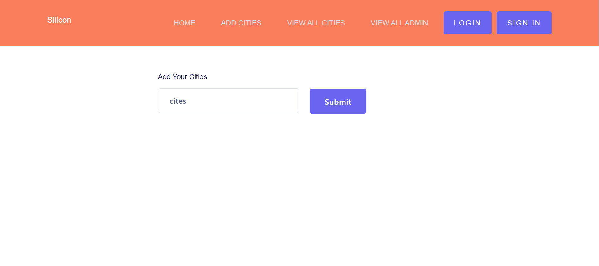
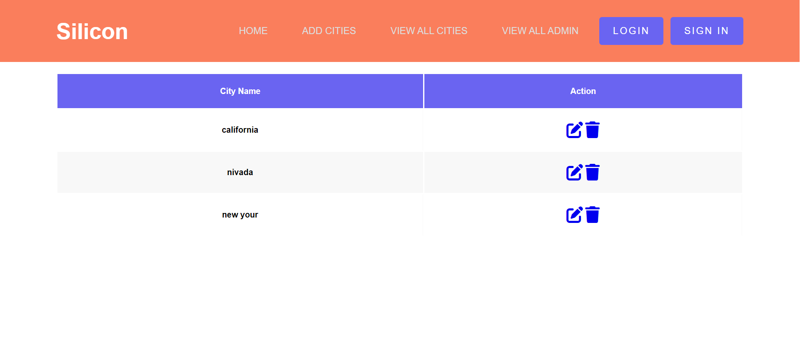
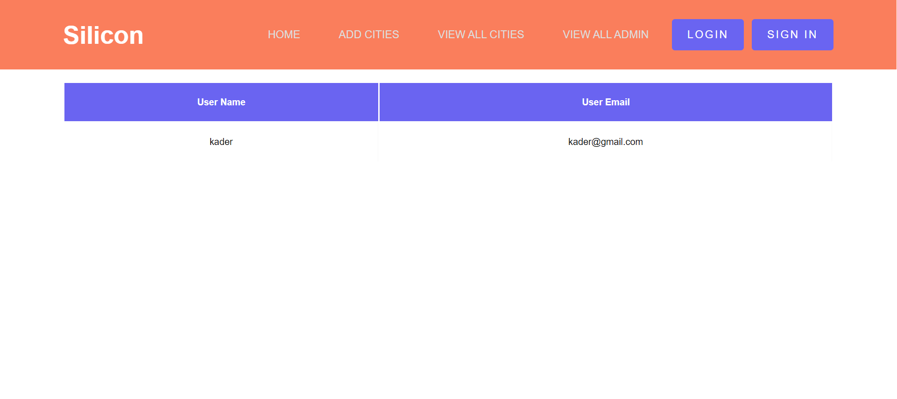
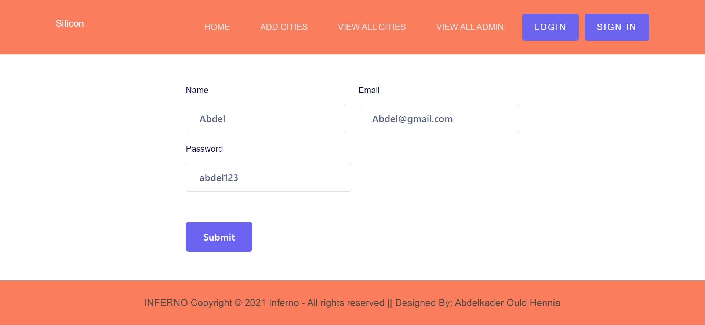
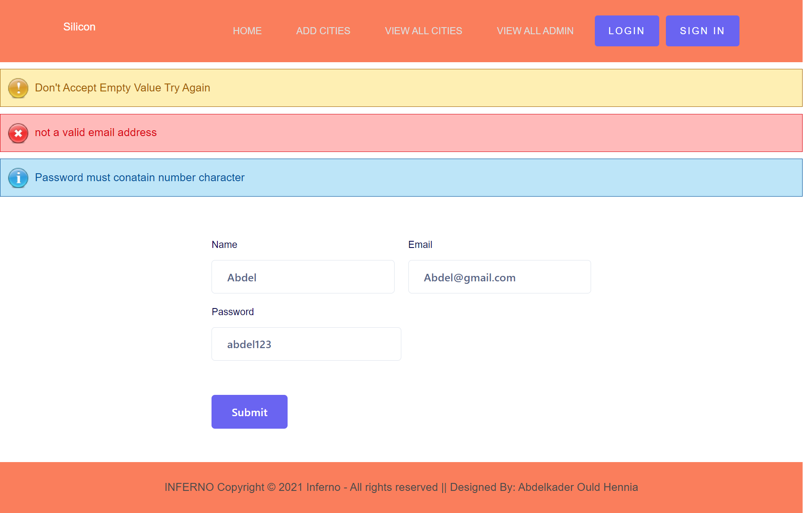
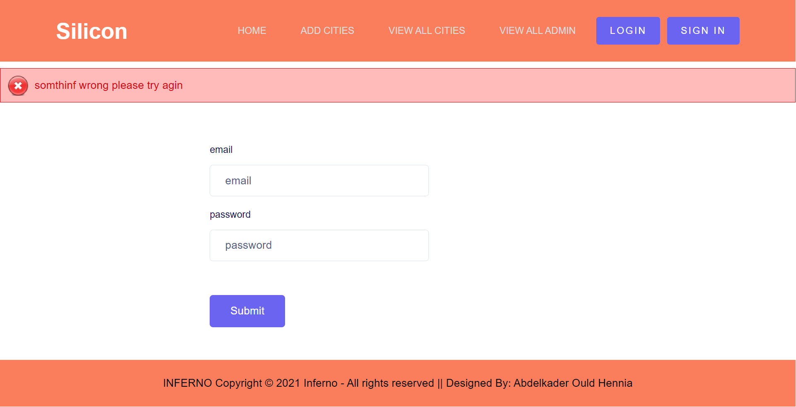
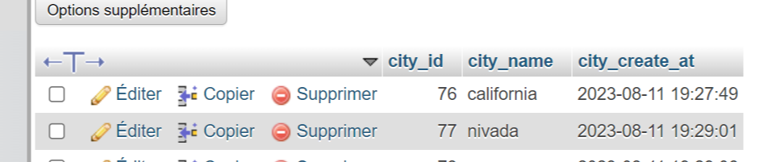
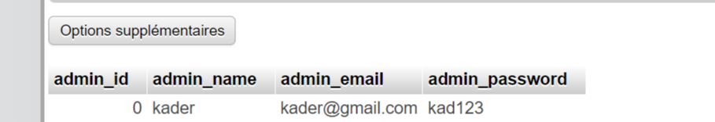

# Website_Php_Mysql_Pure

<h3>Overview About Project</h3>
<video width="320" height="240" controls>
  <source src="./screeshotProjecy/scrnli_8_11_2023_7-54-41 PM.mp4" type="video/mp4">
</video>
<h3>ScreenShot About Project</h3>

<h3>Overview About DataBase Insert Data</h3>

1- Install XAMPP

2- Open XAMPP Control panal and start [apache] and [mysql]

3- Download project from github (https://github.com/Kader1680/Php-Mysql-website.git)

4- extract files in (htdocs) folder and keep the folder name apricot-store (After installing the XAMPP, open the (XAMPP) folder. then you will get (htdocs) folder)

5- open link http://localhost/phpmyadmin

6- click on new at side navbar

7- give a database name as (myshop) hit on create button

8- after creating database name click on import

9- browse the file in directory [Xampp\htdocs\Php-Mysql-website]

10- after importing successfully

11- open any browser and type http://localhost/Php-Mysql-website/

12- first register and then login